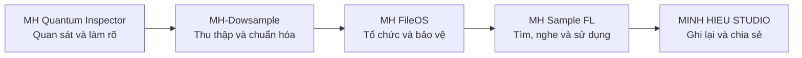
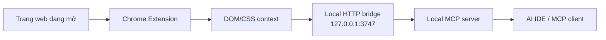

<div align="center">

# MH Quantum Inspector

### Công cụ quan sát giao diện web và chuẩn hóa ngữ cảnh cho AI


[Website](https://studiominhhieu.com/) · [Liên hệ](mailto:support@studiominhhieu.com)

</div>

> [!IMPORTANT]
> MH Quantum Inspector là công cụ cá nhân đang phát triển. Dự án giúp người dùng chọn đúng phần tử giao diện, lấy ngữ cảnh DOM/CSS và mô tả vấn đề rõ hơn cho AI. Công cụ chưa qua security audit, chưa phát hành trên Chrome Web Store và chưa được tuyên bố là tiện ích ổn định cho mọi website.

## Mục lục

- [Vì sao dự án này tồn tại?](#vì-sao-dự-án-này-tồn-tại)
- [Vị trí trong hệ sinh thái MH](#vị-trí-trong-hệ-sinh-thái-mh)
- [Công cụ thu thập gì?](#công-cụ-thu-thập-gì)
- [Kiến trúc hoạt động](#kiến-trúc-hoạt-động)
- [Cài đặt extension](#cài-đặt-extension)
- [Chạy MCP server](#chạy-mcp-server)
- [Hướng dẫn sử dụng](#hướng-dẫn-sử-dụng)
- [Quyền và quyền riêng tư](#quyền-và-quyền-riêng-tư)
- [Giới hạn hiện tại](#giới-hạn-hiện-tại)
- [Cấu trúc dự án](#cấu-trúc-dự-án)
- [Nguyên tắc phát triển](#nguyên-tắc-phát-triển)
- [Liên hệ](#liên-hệ)

## Vì sao dự án này tồn tại?

Khi làm việc với AI, một yêu cầu như “sửa phần này đẹp hơn” thường quá mơ hồ. AI chưa biết phần tử nào, selector gì, kích thước bao nhiêu, CSS nào đang tác động hoặc người dùng muốn sửa theo hướng nào.

MH Quantum Inspector được tạo để rút ngắn khoảng cách đó:

```text
Người dùng nhìn thấy vấn đề
→ Chọn đúng phần tử
→ Thu thập DOM, vị trí và style
→ Tạo ngữ cảnh có cấu trúc
→ Người dùng bổ sung mục tiêu
→ Gửi cho AI hoặc coding agent
```

Minh Hiếu bắt đầu dự án từ nhu cầu thực tế, không phải từ việc đã có nền tảng lập trình. AI giúp thực hiện nhanh hơn, nhưng người dùng vẫn là người quyết định mục tiêu, phạm vi và kết quả cuối cùng.

## Vị trí trong hệ sinh thái MH



MH Quantum Inspector là lớp **quan sát và làm rõ**. Nó không xử lý sample trực tiếp, nhưng giúp anh kiểm tra giao diện của các dự án MH, lấy đúng ngữ cảnh và giao việc cho AI bớt sai, bớt vòng vo.

## Công cụ thu thập gì?

Source hiện có khả năng lấy hoặc tạo:

- tag và CSS selector của phần tử;
- kích thước và vị trí;
- display, position và z-index;
- một số computed styles quan trọng;
- inline styles khi có;
- box model và ngữ cảnh phục vụ debug;
- prompt có cấu trúc cho các mục tiêu như debug, sửa CSS, accessibility, explain, refactor hoặc animate;
- payload gần nhất để MCP client đọc lại.

Công cụ không tự hiểu ý định cuối cùng. Người dùng phải bổ sung mục tiêu như “giữ nguyên bố cục nhưng tăng độ tương phản” hoặc “sửa lỗi tràn ngang trên mobile”.

## Kiến trúc hoạt động



### Thành phần chính

| Thành phần | Vai trò |
|---|---|
| Chrome Extension | Chọn phần tử và hiển thị inspector |
| Content scripts | Đọc DOM, selector, geometry và style |
| Prompt generator | Chuyển dữ liệu thành ngữ cảnh dễ sử dụng |
| HTTP sync bridge | Nhận payload local từ extension |
| MCP server | Cung cấp tool cho MCP client |
| `.last-payload.json` | Có thể lưu payload gần nhất ở máy local |

## Cài đặt extension

### Yêu cầu

- Google Chrome hoặc trình duyệt Chromium hỗ trợ Manifest V3.
- Repository đã được tải hoặc clone về máy.

### Các bước

1. Mở `chrome://extensions/`.
2. Bật **Developer mode**.
3. Chọn **Load unpacked**.
4. Chọn thư mục root của repository.
5. Ghim extension lên toolbar nếu cần.
6. Kiểm tra quyền extension trước khi sử dụng.

> [!NOTE]
> Đây là cách nạp extension phục vụ phát triển. Dự án chưa được phát hành trên Chrome Web Store.

## Chạy MCP server

### Yêu cầu

- Node.js.
- Terminal có quyền đọc và ghi trong thư mục repository.

### Khởi động

```bash
node mcp/mcp-server.js
```

Mặc định bridge local lắng nghe tại:

```text
127.0.0.1:3747
```

Có thể đổi cổng bằng biến môi trường:

```bash
MHQ_PORT=4000 node mcp/mcp-server.js
```

Trên PowerShell:

```powershell
$env:MHQ_PORT=4000
node mcp/mcp-server.js
```

### Tool MCP hiện có

| Tool | Chức năng |
|---|---|
| `mh_get_last_element` | Lấy ngữ cảnh phần tử gần nhất và tạo prompt theo template |
| `mh_get_element_selector` | Lấy selector gần nhất |
| `mh_get_element_styles` | Lấy computed styles và inline styles |

Cách cấu hình command vào Cursor, Claude hoặc MCP client khác phụ thuộc phiên bản của phần mềm đó. Người dùng cần kiểm tra tài liệu của client đang sử dụng.

## Hướng dẫn sử dụng

1. Chạy MCP server nếu muốn đồng bộ sang AI IDE.
2. Mở trang web cần kiểm tra.
3. Nhấn `Ctrl + Shift + X` trên Windows hoặc `Cmd + Shift + X` trên macOS.
4. Di chuột và chọn đúng phần tử.
5. Kiểm tra selector, box model, geometry và styles.
6. Chọn hoặc sao chép prompt phù hợp.
7. Bổ sung mục tiêu bằng ngôn ngữ của người dùng.
8. Chỉ gửi phần dữ liệu cần thiết cho AI.

### Ví dụ yêu cầu tốt

```text
Phần tử cần sửa: nút CTA trong hero.
Vấn đề: chữ bị xuống hai dòng ở màn hình 390px.
Mục tiêu: giữ chiều cao nút, không đổi màu và không làm ảnh hưởng desktop.
Dữ liệu selector/CSS: lấy từ MH Quantum Inspector.
```

Ví dụ trên tốt hơn yêu cầu “sửa nút này đẹp lên” vì có phần tử, lỗi, giới hạn và mục tiêu cụ thể.

## Quyền và quyền riêng tư

> [!CAUTION]
> Manifest hiện khai báo `host_permissions: <all_urls>`. Điều này cho phép extension hoạt động trên nhiều trang, đồng thời tạo ra trách nhiệm lớn về quyền riêng tư.

Người dùng cần biết:

- extension có thể đọc cấu trúc và style của phần tử trên trang đang được kiểm tra;
- payload được gửi tới bridge local khi người dùng thực hiện thao tác liên quan;
- payload gần nhất có thể được ghi vào `mcp/.last-payload.json`;
- bridge chỉ nên chạy ở `127.0.0.1`;
- không nên inspect trang ngân hàng, email, tài khoản hoặc dữ liệu nhạy cảm;
- phải dừng MCP server khi không sử dụng;
- không chia sẻ file payload nếu chưa xem nội dung;
- repository chưa có security audit độc lập.

## Giới hạn hiện tại

- Chưa kiểm thử trên mọi website và mọi shadow DOM.
- Selector có thể không ổn định với trang thay đổi động.
- Computed styles được chọn lọc, không phải toàn bộ CSS cascade.
- MCP bridge chưa phải dịch vụ production.
- Chưa có cơ chế authentication hoàn chỉnh cho bridge local.
- Chưa có Chrome Web Store review.
- Chưa có cam kết hỗ trợ hoặc SLA.
- Demo đẹp không phải bằng chứng công cụ an toàn hoặc hoàn thiện.

## Cấu trúc dự án

```text
MH-Quantum-Inspector/
├─ manifest.json
├─ background.js
├─ content.js
├─ inspector.css
├─ popup/
├─ utils/
│  ├─ dom-crawler.js
│  ├─ prompt-generator.js
│  └─ payload-schema.js
├─ mcp/
│  └─ mcp-server.js
├─ icons/
└─ check/
```

Các video trong `check/` chỉ là tài liệu demo nội bộ. Chúng không tự động chứng minh mọi chức năng đã được nghiệm thu.

## Nguyên tắc phát triển

1. Người dùng quyết định mục tiêu; AI hỗ trợ thực hiện.
2. Ngữ cảnh phải đến từ dữ liệu thật.
3. Không gửi nhiều dữ liệu hơn mức cần thiết.
4. Local-first không đồng nghĩa tự động an toàn; vẫn phải kiểm tra quyền và payload.
5. Không gọi công cụ là production-ready khi chưa audit và kiểm thử.
6. README phải nói rõ cách cài, cách dùng, giới hạn và rủi ro.
7. Chỉ chia sẻ rộng hơn khi công cụ đủ rõ ràng và an toàn.

## Liên hệ

- Website: https://studiominhhieu.com/
- Email: support@studiominhhieu.com
- GitHub: https://github.com/studiozengermany-cmd

---

<div align="center">

**Quan sát đúng → mô tả rõ → AI làm chính xác hơn.**

</div>
